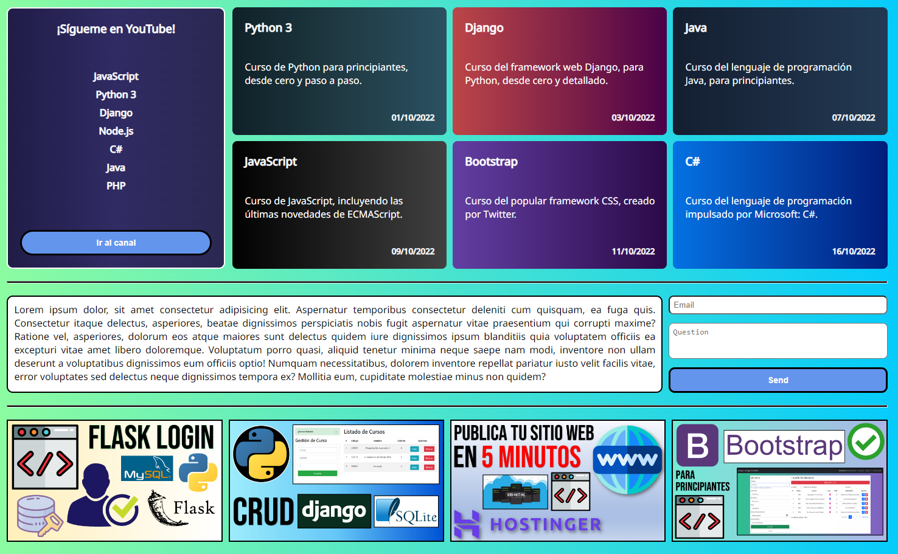
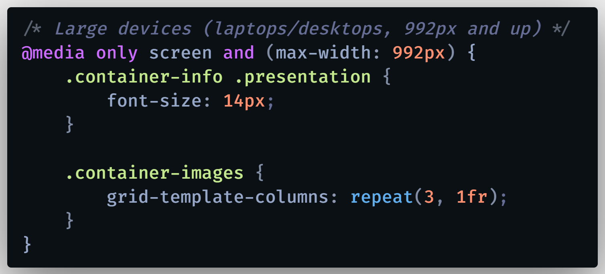

# CSS Grid - Flexbox: Tutorial desde Cero, para Principiantes, Curso en español, Ejemplo Práctico

Aprende a utilizar CSS Grid y Flexbox en tus sitios web, entendiendo sus conceptos básicos y fundamentos de diseño, de esta manera podrás estilizar tus aplicaciones web muy fácilmente y volverlas responsivas (Responsive Design). Aprende a crear páginas web responsivas y conoce las similitudes/diferencias entre CSS Grid y Flexbox, cuándo usar uno u otro y para cuáles tipos de diseño es mejor cada uno de ellos.

🔴 *** HOSTING RECOMENDADO *** 
Hostinger: : https://www.hostg.xyz/SHB9X 
¡Usa el código USKOKRUM2010 para un buen descuento!

  

# 🌍 Por si deseas contactarme 👨‍💻 :

